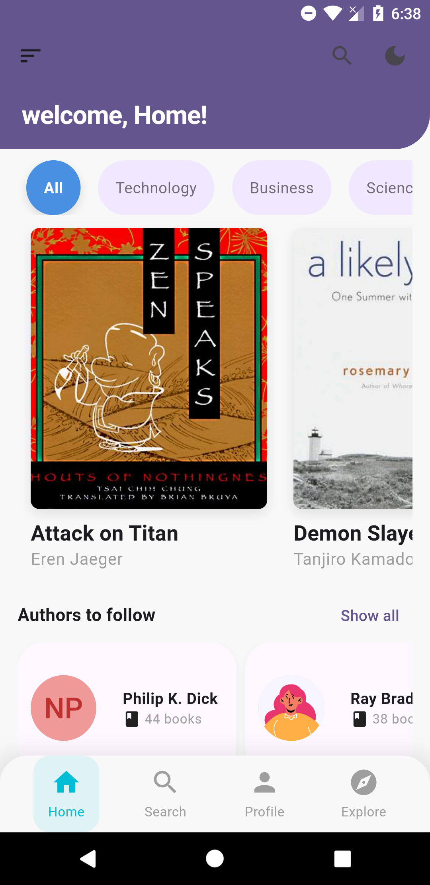

## Screenshots

### Home Screen

The **Home Screen** offers a welcoming interface, guiding users to explore various book categories and authors. Key features of this screen include:

- **Top Navigation**:
  - A greeting text, "Welcome, Home!", setting a friendly tone.
  - Icons for navigation: 
    - A **hamburger menu** icon for additional options (left).
    - A **search icon** for finding specific books or authors (right).
    - A **theme toggle icon** to switch between light and dark modes.

- **Category Tabs**:
  - A row of **category tabs** (e.g., All, Technology, Business, Science) allowing users to filter books by genre. The currently selected category is highlighted for easy identification.

- **Book Recommendations**:
  - Each book in the main section includes:
    - A **cover image**.
    - The **book title** and **author name** displayed below for quick reference.
  - The book tiles are displayed in a horizontally scrollable row, making it easy to browse through multiple recommendations.

- **Authors to Follow**:
  - A section titled "Authors to Follow" encourages users to explore and connect with popular authors.
  - Each author card displays:
    - **Author's profile picture or initials**.
    - **Name** of the author and a small **icon with the number of books** they have published.
  - A "Show all" button on the right allows users to view a complete list of authors.

- **Bottom Navigation Bar**:
  - The bottom bar provides quick access to main app sections:
    - **Home** (currently selected and highlighted).
    - **Search**, **Profile**, and **Explore** sections.

The layout is designed for clarity and easy navigation, with a focus on enhancing the user experience for browsing books and discovering new authors.

### 2. Book Detail Section with Action Buttons

The header section displays:
- A **background image** with a subtle **blur** and **overlay** effect to make text readable.
- **Title** and **Author’s Name** in large, bold fonts for clarity.
- **Back Button** positioned on the top left.

The book detail section includes:
- The **Book Title** and **Author** below the header.
- **Rating Stars** for visual feedback on the book’s rating.
- **Description** of the book with a brief summary.
- **Action Buttons**:
  - **Want to Read** button in a filled, primary style.
  - **Get a Copy** button outlined to differentiate actions.

---
